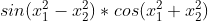
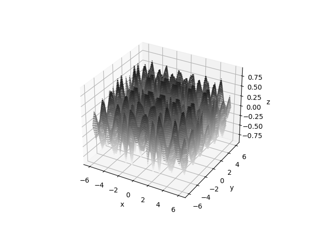
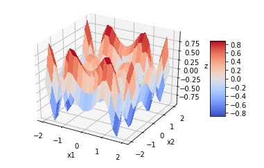
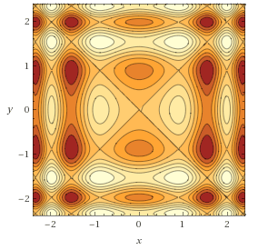
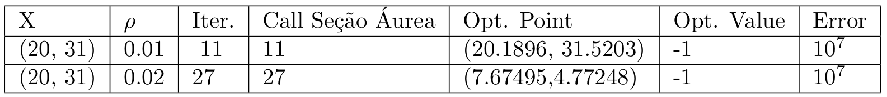
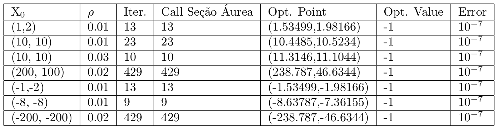
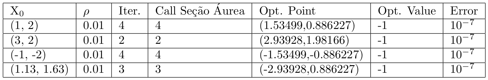
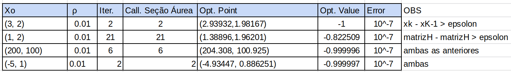
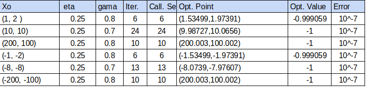

# Non linear programming

## Objectives

Implement different non linear optimization methods and apply them in a function of study

## The function of study:

## We start with a brief analysis of the function

3D plot:

The domain of the function is R² and the image belongs to the interval [-1,1]. This domain is compact and convex.

Because it is composed of limited functions, the function is not coercive.

Also, by fixing one of the variables, the function shows periodicity.

Since both variables are always squared everywhere in the function, the value evaluated in the range x1, x2 belongs to ]-inf, 0] is the same as the value evaluated in the range x1, x2 belongs to [0, +inf[ . if |x1|, |x2| remains constant

Therefore, the contour plot demonstrates symmetry in relation to the x = 0 and y = 0 axes.

## Golden-Section Search

We have that phi(intermediate) < phi(b) because we need to find an interval where its derivative is positive.

As the function has several minimum peaks throughout its domain, it is interesting to set the rho variable to a small value.

In the table above, with the help of the gradient descent method, we can see that doubling rho can make a big difference when finding the resulting minimum point in this function

## Gradient Descent with Golden-Section Search

From these results, it is possible to infer that the density of minimum points is much higher for values ​​of (x1, x2) whose moduli are small (small ~[0, 40]). Furthermore, we see the symmetry of the function in practice when analyzing the results starting at points (1, 2) and (-1, -2). Still, by varying rho, we see that the interval [a, b] changes, leading to the discovery of different minimum points, as we see in (10, 10).
 
## Newton's Method

We notice that convergence in Newton's method is much faster at points close to the optimal. As the method did not converge at several points, we can say that the function is not convex.

## Almost Newton

Utilizando BFGS

In order for the method to converge at certain points, it was necessary to add other stopping conditions (specified in the OBS column). matrixH - matrixH > epsolon uses a function that "calculates" a modulus of an matrix. This way I estimate the difference between the "modules" before and after the array is updated. This difference was not enough for the point (1, 2) to converge as soon as the result didn't change much, but it was enough to not let the method explode. Before that, only with the constraint xk = xk-1 > epsolon the method stopped in the 2nd iteration, with the function valid ~-0.2.

I couldn't find a point where the Almost Newton Method didn't converge.

## Backtracking line search (Armijo)
### Gradient Descent

The points calculated by the gradient-descent method using Armijo's search are the same calculated using the golden section in this same method. We can see that Armijo's method is less accurate (at least in some points) than the golden section search. On the other hand, the method converged in much fewer iterations.
